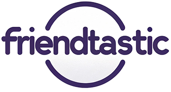
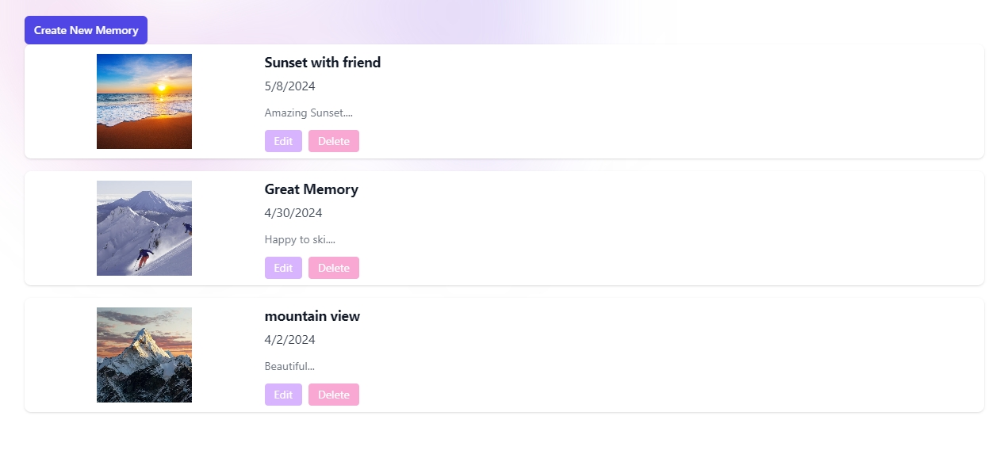
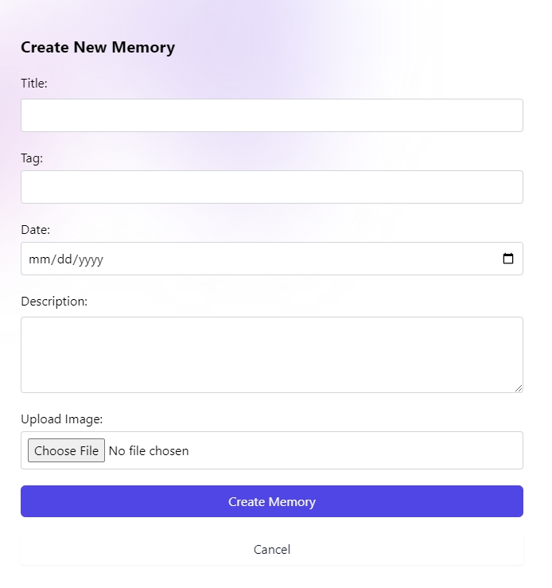
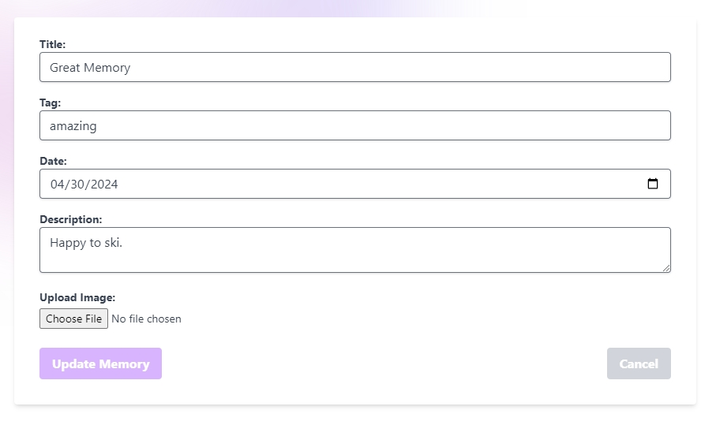

<p align="center"></p>

<h1 align="center">Friendtastic</h1>

<p align="center">A comprehensive tool for managing and enhancing your personal relationships through technology, tailored specifically for introverts. Utilizing advanced AI features, Friendtastic simplifies social management and fosters deeper connections.</p> 

<hr>

## Background/Motivation
In today's fast-paced world, managing personal relationships can be challenging, particularly for introverts who may find the social demands of life overwhelming. Existing social management tools often lack depth in personalization and fail to provide meaningful interactions, making them less effective for those who struggle with social engagement.

**Friendtastic** is designed to bridge this gap. It not only aids in remembering important dates and preferences but also uses advanced AI to suggest personalized activities and gifts, making social interactions simpler and more meaningful. This tool is particularly tailored to help introverts manage their social circles without the stress of remembering every small detail, thus reducing social fatigue and enhancing the quality of interpersonal relationships.

<br>

## Installation Guide

To set up Friendtastic on your system using Docker, follow these steps:

### Prerequisites
- **Docker Desktop**: Install Docker Desktop on your system. You can download it from [Docker's official site](https://www.docker.com/products/docker-desktop).

### Setting up the project
1. **Clone the repository:**
   ```bash
   git clone https://github.com/XuanLuo0329/Friend_management_solution_Friendtasitc.git

   cd friendtastic
   ```

2. **Launch the application using Docker:**
   - Ensure Docker Desktop is running.
   - Execute the following command in the terminal:
    ```bash
     docker-compose up -d
    ```

   This command builds the Docker image if it's not already built and starts the containers in detached mode.

3. **Initialize the database and add some default information for testing purposes.:**
   - Ensure Docker Desktop is running.
   - Execute the following command in the terminal:
    ```bash
     docker-compose exec backend node ./src/db/init-db.js
    ```

4. **Access the application:**
   - Open your web browser and navigate to `http://localhost:5173`.

    You should now be able to interact with the Friendtastic homepage and begin managing your relationships more effectively!

5. **Test users accounts:**
   
   Enjoy exploring the application! You can register your own account, or you may use an account we have already created for you. The account details are as follows:
   - Username: XuanLuo@outlook.com, Password: Test123456!
    

## Explore Friendtastic

Dive into Friendtastic and discover how easy it is to enhance your social interactions! Our platform offers a range of features tailored to help you manage your relationships effortlessly. From AI-powered reminders for important dates to personalized gift and event suggestions, Friendtastic is your go-to tool for enriching interpersonal connections.

### Key Features Include:
- **Personalized gift recommendations:** Get tailored gift ideas based on your friends' interests.
- **Event recommendation:** Find the perfect event to attend with your friends.


#### Gift Recommendation

- Navigating to the Gift Recommendation Form

  After logging in, users can access the Gift Recommendation form by clicking on "Gift Recommendation" in the navigation menu. This page features a form where users select the recipient of the gift and specify their requirements. The fields "Pick a Friend," "Gift Purpose," "Min Budget," and "Max Budget" are mandatory, while "Specific Requirements" is optional. At the bottom of the form, there are "Reset" and "Submit" buttons. The **"Reset"** button clears all input fields and resets the form to its initial state. Upon clicking **"Submit"**, the button changes to **"Loading"**, and once the loading is complete, it changes to **"Retry"**, prompting users to make another recommendation request. **During the loading phase, all buttons and form fields are disabled.**

  

- Friend Card

  Within the "Pick a Friend" selector, only the user’s friends are displayed. Selecting a friend will display a card on the right side of the form, showing details about the friend for reference. This card includes a button that leads to the friend’s gift list.

  

- Gift Display

  After submitting the form, the system displays three recommended gifts based on the user's requirements. Each gift display includes the gift's name, a preview image, reasons for choosing the gift, and possible places to purchase the gift. Each gift has an "Add to Gift List" button at the bottom right corner. Upon clicking this button, users will see a message such as "Gift added successfully!" or "This gift has already been added." If the addition fails for some other reason, an appropriate error **message will be displayed for 15 seconds** before disappearing. To prevent spam, the **"Add to Gift List" button is disabled for 3 seconds after each click.** The gift suggestions only appear after the user submits the form and will disappear if the user hits reset. 
  
  **Additionally, if users find a gift suitable for another friend, they can select a different friend from the 'Pick a Friend' dropdown menu and then add the gift to that friend's Gift List.**

  

- Gift List

  The Gift List page features a "Pick a Friend" selector at the top, allowing users to view any friend's Gift List. A "Back to Gift Page" button is also available. The main section of the page displays the history of gifts added to the list, including a "Delete" button for removing unwanted gifts. Clicking this will prompt an alert to confirm the deletion.

  

- System Notes:

  If the DALL-E 2 API is slow or unable to retrieve generated images due to other reasons, a default image will be used. The system does not store images of all recommended gifts, so there is a chance that an image might expire due to timeout. Only images added to the Gift List are stored for future reference.

  Due to the high cost of generating images with DALL-E 2, there is a chance the account may hit its quota limit. If this occurs, the system will display the message **"Exceeded AI API quota! Please inform the team to increase the limit!"**
  Please notify us to replenish funds if needed. Thank you!

#### Event Recommendation


#### Accessing the Event Recommendation Form

- **Navigation**: After logging in, users can access the event recommendation form by selecting "Event Recommendation" from the navigation menu.

- **Form Interface**: The page features a user-friendly form where individuals can enter the type of event they are interested in or specific keywords. Tooltips and input hints guide the user on how to fill out the form effectively.

  

#### Filling Out and Submitting the Form

- **Input Details**: Users input their preferred activities or specific search keywords into the form. This field is designed to accept a wide range of interests to cater to diverse user preferences.

- **Submission Process**: After filling out the form, users click the “Submit” button. The form submission triggers a loading screen, indicating that the system is processing the input to generate personalized event recommendations.

  

#### Displaying Recommended Results

- **Personalized Suggestions**: Based on the user's inputs, the system dynamically generates event recommendations. For instance, entering “I want to go shopping” will prompt the system to suggest suitable events and potential companions based on the user's social connections and their preferences.

  

- **Friend Recommendations**: The results not only focus on event suggestions but also recommend friends who might enjoy the event, enhancing the social experience. For example, the system might suggest shopping with a friend who enjoys similar shopping environments or has complimentary schedules.

  

#### Interactive Results Display

- **Choosing Companions**: Users can select a friend from the recommended list and view tailored suggestions on where to go. This feature allows users to plan outings effectively by aligning interests and availability.

- **Feedback Mechanism**: If users attempt to submit the form without any input, the system provides a friendly reminder to enter information, ensuring that users know how to proceed without confusion.

#### Documentation Screenshots

- Include screenshots demonstrating the form interface, the loading state, and the results page to visually guide the users through the process as shown in the screenshots provided.

  

 The memory list page allow users to view, manage, and interact with a collection of memories. Users can effortlessly create new memories, view detailed information by clicking on any memory, and edit or delete entries as needed, all within a cleanly designed, responsive layout. Each memory is displayed with an image, title, date, and a brief description, making it easy for users to find and manage their cherished moments.

  

- Memory Create and Edit:

 The create and edit pages provides a user-friendly interface for users to add new memories to their collection. It features a form that allows for the entry of essential details such as the title, tag, date, and description of the memory. Users can also upload an image to visually represent their memory. The form includes validation to ensure all required fields are filled before submission. If a user decides not to proceed, there is a cancel button that navigates back to the list of all memories. This component ensures a seamless experience for creating lasting digital memories.

 Create memory:
 

 Edit memory:
 

Start exploring these features and more today! If you have any questions or need assistance, feel free to reach out to us. We are here to help you navigate and make the most of your Friendtastic experience!


## Testing the Application

To ensure that all components of Friendtastic function as expected, comprehensive tests have been implemented for both the frontend and backend. Follow these steps to run the tests:

Before testing, please ensure that you **run the database initialization code in the root directory**.
  
  ```bash
  docker-compose exec backend node ./src/db/init-db.js
  ```

### Frontend Testing
- **Using Vitest:** To run the frontend tests, execute the following command:

  ```bash
  docker-compose exec -it frontend npm run test
  ```

### Backend Testing
- **Using Jest:** To test the backend, use the command:

  ```bash
  docker-compose exec -it backend npm run test
  ```

These commands will execute the respective test suites within the Docker containers, ensuring that your environment remains consistent and isolated from any local dependencies.

## Deployment

### MongoDB Atlas

[MongoDB](https://www.mongodb.com/) provides free shared MongoDB clusters. Although the free version only has 512 MB storage, it is good enough for our project. It is also pretty simple to set up your own MongoDB, just follow the instructions on the website. After the MongoDB cluster is created, go to Security -> Network Access on the left sidebar, and allow 0.0.0.0/0 (anywhere) to access the MongoDB. This would allow the backend application to access the database.

### Application Deployment

Deploying the applications to Cloud is the most cost-effective option for our project. As Microsoft Azure offers student credits, we decided to deploy the frontend and backend applications to Azure.

----
#### Backend Application
As the backend application requires a NodeJS runtime environment to host the application, we decided to use Azure App Services. 

<b>Step 1:</b>
Create a repository in [Docker](https://hub.docker.com/). Mark down the repository name.

<b>Step 2:</b>
Build the docker image for the backend application and push the image to the Docker repository.
```sh
docker build ./backend -t ${repository name}
docker push ${repository name}:${tag}
```

<b>Step 3:</b>
Go to Azure App Services -> Create -> Web App. In the Basic configuration, select Container for the Publish option. In the Container configuration, select Docker Hub or other registries for the Image Source. Type in the repository name and tag for the Image and tag option. After that, you can click Review + create to create the web app.

<b>Step 4:</b>
Set up the environment variables. Go to the Configuration of the Azure Web App -> Application settings -> Advanced edit, and add the below configuration and save the settings. You need to specify the value for JWTPRIVATEKEY, MONGODB_CONNECTION_STRING, OPEN_API_KEY, and SALT.
```json
  {
    "name": "JWTPRIVATEKEY",
    "value": "",
    "slotSetting": false
  },
  {
    "name": "MONGODB_CONNECTION_STRING",
    "value": "",
    "slotSetting": false
  },
  {
    "name": "OPEN_API_KEY",
    "value": "",
    "slotSetting": false
  },
  {
    "name": "PORT",
    "value": "80",
    "slotSetting": false
  },
  {
    "name": "SALT",
    "value": "",
    "slotSetting": false
  },
  {
    "name": "WEBSITES_CONTAINER_START_TIME_LIMIT",
    "value": "1800",
    "slotSetting": false
  },
  {
    "name": "WEBSITES_PORT",
    "value": "80",
    "slotSetting": false
  }
```

<b>Step 5:</b>
Go to the CORS settings of the Azure Web App and allow all origins by adding a * to the Allowed Origins.

----
#### Frontend Application
As the react application can be compiled static HTML website, Azure Static Web App could be the best option to host the frontend application. You can follow the below instructions to deploy the application.

<b>Step 1:</b>
Change the VITE_API_BASE_URL in .env.production to your backend URL and build the app.
```sh
docker run -it --rm -v ./frontend:/app -w /app node:20 sh -c "npm install && npm run build"
```

<b>Step 2:</b>
Go to Static Web App in Azure Console -> Create. In the configuration, select the resource group, input the application name, and choose Other for the Deployment details, then you can click Review + create to create the application. After the application is created, go to the Overview of the application -> Manage deployment token, generate and mark down the token.

<b>Step 3:</b>
Execute the below command to build the Azure Static Web Apps (SWA) CLI docker image, which will be used to deploy the application to the SWA created in step 1.

```sh
docker build -f azure-swa.dockerfile -t swa .
```

<b>Step 4:</b>
Deploy to Azure. Replace the deployment token in the below command.
```sh
docker run -it --rm -v ./frontend:/app swa swa deploy --deployment-token ${deployment token} -a ./dist --swa-config-location .
```

#### CI/CD via Github Action
Two Github Actions are created to deploy the latest change on the main branch to the production environment. 

For the frontend application, there are no additional settings required. 

For the backend application, you need to do below settings.
- Enable the "Continuous deployment" under the settings of Deployment Center of your Azure Web App. 
- Copy the Webhook URL to the Docker repository to trigger the continuous deployment once a new image is pushed to the repository. 
- Enable the "SCM Basic Auth Publishing Credentials" under the General Settings of Configuration menu to allow Docker to call the Webhook URL.

## Conclusion

Thank you for exploring Friendtastic! We hope this guide helps you understand how to set up and test our application effectively. We appreciate your interest and are excited to see how Friendtastic can enhance your ability to manage and enrich your personal relationships.

## Deployment
This application is deployed at [https://www.friendtastic.fun](https://www.friendtastic.fun). 

